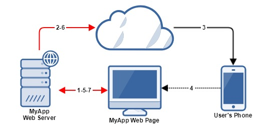

# Two-Factor Authentication
$KANDY$ provides [Authentication API](/developer/references/nodered/1.0.0#twofactor-send-code) using which a two-factor authentication (2FA) flow can be implemented.

Sections below describe two sample use cases, two-factor authentication via SMS and two-factor authentication via e-mail.

## Two-Factor Authentication via SMS
The following diagram explains a sample use case and its logical flow for two-factor authentication via SMS:



1. User opens the MyApp web page, enters credentials, and clicks login
2. MyApp web server initiates two-factor authentication via SMS flow, sends request to $KANDY$ to send validation code
3. User receives the code via SMS
4. User enters the code on MyApp web page
5. User submits the code
6. MyApp web server sends validation request to $KANDY$ with the code user entered and receives the result
7. MyApp web page takes the action based on the result

Your $KANDY$ admin can purchase SMS DID and assign to the MyApp project, so that the two-factor authentication SMS sent to app users always has the same originating number seen on the phone. Otherwise, the number seen on app users' phones may differ per transaction.

First, MyApp web server sends request to send a two-factor authentication code. This can be done by using the `2FA` node. This 2FA node has to be configured to send a verification code by selecting the `Operation Type` as `Send 2FA`. The the relevant information has to be passed down to the form such as:

Method -> SMS
Destination Address -> +12847881823
Expiry -> 360
Message -> Your code is {code}
Length -> 6
Type -> alphanumeric

The `cpaas_response` contains `codeId` which is a unique ID needed for code verification. The response object can look something like this:
```js
{
  codeId: '1fc8907-d336-4707-ad3c'
}
```

Walking through the method parameters:

+ `Destination Address` is required with a routable destination number in E.164 format, either with tel schema or not. For SDK v1, only one address is supported.
+ `Method` is mandatory and must have `sms` for verification via SMS flow.
+ `Expiry` indicates the desired period of time in seconds that the code will be valid on $KANDY$. It is optional having default value as 120 seconds, while application can ask for values between 30 and 3600 seconds.
+ `Message` is required with a `{code}` string within the text so that $KANDY$ can replace that with the real code generated, and send it as the SMS content.
+ `Length` indicates the desired length of the code, default value is 6 and application can request for values between 4 and 10.
+ `Type` indicates the desired type of the code from the set `numeric`, `alphanumeric`, `alphabetic`. Default is `numeric`.

The `codeId` in the `response` object should be used for verifying the user’s verification code or resending a new verification code to the user.

To verify the code, a new `2FA` node can be added to the flow with operation type as `Verify 2FA`. The the relevant information has to be passed down to the form such as:

Code ID -> 1fc8907-d336-4707-ad3c
Verification code -> 123456

In the response, `verified: true` means code is verified and removed from $KANDY$, while `verified: false` indicates the code is not valid.

A successful verification will have the following response:
```js
{
  verified: true,
  message: 'Success'
}
```
An invalid/failed verification will have the following response:
```js
{
  verified: false,
  message: 'Code expired or invalid'
}
```

## Two-Factor Authentication via E-mail
A similar flow with the SMS section above can be implemented for e-mail verification.

The following email code request example, requires an additional parameter `Subject`. When value `email` is selected/used in the `method` parameter then `subject` becomes a mandatory field to pass. The value passed becomes the subject line of the 2FA code email that is sent out to the destinationAddress:

Destination address -> johndev@someemail.com
method -> email
length -> 10,
type -> alphanumeric,
expiry -> 3600,
message -> Here is your code: {code},
subject -> Verification code

The response contains `codeId` which is a unique ID needed for `verify_code`. The response object can look something like this:
```js
  {
    codeId: '1fc8907-d336-4707-ad3c'
  }
```

As can be seen within the example, `method` parameter has `email` value, while `Destination address` field includes a destination e-mail address. For SDK v1, only plain text is supported.

Verification procedure for two-factor authentication via e-mail is same with two-factor authentication via SMS as described in previous section.

## Additional Operations
The `code` can be:

+ Resend using the same resource, which "invalidates" the previously sent code and triggers a new SMS or email containing a new code.
+ Deleted explicitly if desired (deletion operation does not block the previously started send operation)

## References
For all two factor authentication related method details, refer to [Two Factor Authentication](/developer/references/nodered/1.0.0#twofactor-send-code).
